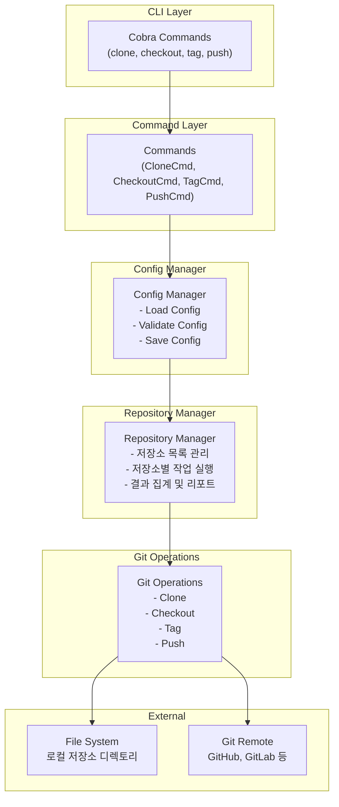
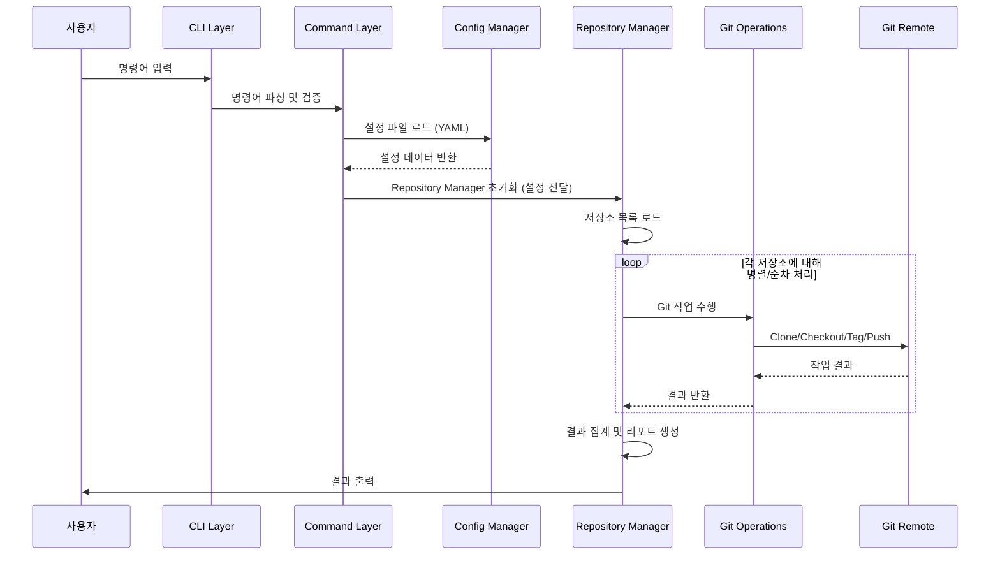

# Multi-Git 관리 도구 Tech Spec (Technical Specification)

## 1. 기술 스택

### 1.1 개발 언어 및 버전
- **언어**: Go 1.24
- **모듈 시스템**: Go Modules

### 1.2 주요 의존성
- **CLI 프레임워크**: `github.com/spf13/cobra` - 명령어 구조화 및 파싱
- **Git 라이브러리**: `github.com/go-git/go-git/v5` - Git 작업 수행
- **설정 파일**: `gopkg.in/yaml.v3` - YAML 설정 파일 파싱
- **출력 포맷팅**: `github.com/fatih/color` - 터미널 색상 출력 (선택사항)
- **병렬 처리**: Go의 `sync` 패키지 및 `goroutine` 활용

### 1.3 빌드 및 배포
- 단일 바이너리로 컴파일
- 크로스 컴파일 지원 (Linux, macOS, Windows)
- 설치 스크립트 제공

## 2. 아키텍처 구조

### 2.1 전체 아키텍처 다이어그램



### 2.2 패키지 구조

```
multi-git/
├── cmd/
│   └── multi-git/
│       └── main.go              # CLI 진입점
├── internal/
│   ├── commands/
│   │   ├── clone.go            # clone 명령어
│   │   ├── checkout.go         # checkout 명령어
│   │   ├── tag.go              # tag 명령어
│   │   └── push.go             # push 명령어
│   ├── repository/
│   │   ├── manager.go          # 저장소 관리자
│   │   └── repo.go             # 저장소 구조체
│   ├── git/
│   │   ├── operations.go       # Git 작업 수행
│   │   └── client.go           # Git 클라이언트 래퍼
│   └── config/
│       ├── loader.go           # 설정 파일 로더
│       ├── config.go           # 설정 구조체
│       └── validator.go        # 설정 검증
├── pkg/
│   └── errors/
│       └── errors.go           # 커스텀 에러 타입
├── configs/
│   └── config.yaml.example    # 설정 파일 예시
└── docs/
    ├── PRD.md
    └── TECH_SPEC.md
```

### 2.3 데이터 흐름



## 3. 핵심 기능 상세 설계

### 3.1 저장소 클론 기능 (Clone)

#### 3.1.1 기능 개요
여러 Git 저장소를 한 번에 클론하는 기능

#### 3.1.2 구현 상세

**명령어 구조:**
```bash
multi-git clone [flags]
```

**Flags:**
- `--config, -c`: 설정 파일 경로 (기본값: `~/.multi-git/config.yaml`)
- `--skip-existing`: 이미 존재하는 저장소 스킵 (기본값: true)
- `--parallel, -p`: 병렬 클론 개수 (기본값: 3)
- `--depth`: Shallow clone depth (선택사항)

**구현 로직:**
1. 설정 파일에서 저장소 목록 로드
2. 각 저장소에 대해:
   - 저장소 디렉토리 존재 여부 확인
   - `--skip-existing`이 true이고 이미 존재하면 스킵
   - 저장소 이름 추출 (URL에서 마지막 경로)
   - `git clone <url> <directory>` 실행
3. 병렬 처리로 성능 최적화 (goroutine pool)
4. 결과 집계:
   - 성공/실패 개수
   - 실패한 저장소 목록 및 에러 메시지
   - 총 소요 시간

**에러 처리:**
- 네트워크 오류: 재시도 로직 (최대 3회)
- 인증 오류: 명확한 에러 메시지
- 디스크 공간 부족: 조기 실패

**출력 형식:**
```
Cloning repositories...
  ✓ repo1 (2.3s)
  ✓ repo2 (1.8s)
  ✗ repo3 (0.5s) - authentication failed
  ✓ repo4 (2.1s)

Summary:
  Success: 3
  Failed: 1
  Total time: 2.3s
```

#### 3.1.3 데이터 구조

```go
type CloneConfig struct {
    Repositories []Repository `yaml:"repositories"`
    BaseDir      string       `yaml:"base_dir"`
}

type Repository struct {
    Name string `yaml:"name"`
    URL  string `yaml:"url"`
    Path string `yaml:"path,omitempty"` // 선택적 경로 오버라이드
}
```

### 3.2 브랜치 일괄 변경 기능 (Checkout)

#### 3.2.1 기능 개요
관리되는 모든 저장소의 동일한 브랜치 이름으로 한 번에 체크아웃

#### 3.2.2 구현 상세

**명령어 구조:**
```bash
multi-git checkout <branch-name> [flags]
```

**Flags:**
- `--create, -c`: 브랜치가 없으면 생성
- `--force, -f`: 로컬 변경사항 무시하고 강제 체크아웃
- `--fetch`: 체크아웃 전 fetch 수행

**구현 로직:**
1. 설정 파일에서 저장소 목록 로드
2. 각 저장소에 대해:
   - 저장소 디렉토리 존재 확인
   - `git fetch origin` (--fetch 옵션 시)
   - 현재 브랜치 확인
   - 로컬 변경사항 확인 (--force가 아닌 경우)
   - `git checkout <branch-name>` 실행
     - 브랜치가 없고 --create 옵션이 있으면 `git checkout -b <branch-name>`
     - 원격 브랜치 추적: `git checkout -b <branch-name> origin/<branch-name>`
3. 결과 집계 및 리포트

**에러 처리:**
- 저장소가 클론되지 않음: 명확한 에러 메시지
- 브랜치가 존재하지 않음: --create 옵션 안내
- 로컬 변경사항 충돌: --force 옵션 안내
- 원격 브랜치가 없음: 경고 메시지

**출력 형식:**
```
Checking out branch: release/v1.0.0
  ✓ repo1: main → release/v1.0.0
  ✓ repo2: develop → release/v1.0.0
  ✗ repo3: branch 'release/v1.0.0' not found
  ✓ repo4: already on release/v1.0.0

Summary:
  Success: 3
  Failed: 1
```

#### 3.2.3 데이터 구조

```go
type CheckoutResult struct {
    RepoName    string
    Success     bool
    OldBranch   string
    NewBranch   string
    Error       error
}
```

### 3.3 태그 동시 관리 기능 (Tag)

#### 3.3.1 기능 개요
특정 브랜치에 태그를 여러 저장소에 동시에 생성 및 푸시

#### 3.3.2 구현 상세

**명령어 구조:**
```bash
multi-git tag --branch <branch> --name <tag-name> [flags]
```

**Flags:**
- `--branch, -b`: 태그를 생성할 브랜치 이름 (필수)
- `--name, -n`: 태그 이름 (필수)
- `--message, -m`: 태그 메시지
- `--push, -p`: 태그를 원격에 푸시
- `--force, -f`: 기존 태그 덮어쓰기
- `--delete, -d`: 태그 삭제

**구현 로직:**

**태그 생성:**
1. 설정 파일에서 저장소 목록 로드
2. 각 저장소에 대해:
   - 저장소 디렉토리 존재 확인
   - 지정된 브랜치로 체크아웃 (필요시)
   - 태그 존재 여부 확인
   - `git tag -a <tag-name> -m <message>` 실행
   - `--push` 옵션 시 `git push origin <tag-name>` 실행
3. 결과 집계

**태그 삭제:**
1. 각 저장소에서 `git tag -d <tag-name>` 실행
2. `--push` 옵션 시 `git push origin --delete <tag-name>` 실행

**에러 처리:**
- 태그가 이미 존재: --force 옵션 안내
- 브랜치가 없음: 명확한 에러 메시지
- 푸시 실패: 네트워크/권한 에러 구분

**출력 형식:**
```
Creating tag 'v1.0.0' on branch 'release/v1.0.0'
  ✓ repo1: tag created and pushed
  ✓ repo2: tag created and pushed
  ✗ repo3: tag 'v1.0.0' already exists (use --force to overwrite)
  ✓ repo4: tag created and pushed

Summary:
  Success: 3
  Failed: 1
```

#### 3.3.3 데이터 구조

```go
type TagConfig struct {
    Branch  string
    Name    string
    Message string
    Push    bool
    Force   bool
    Delete  bool
}

type TagResult struct {
    RepoName string
    Success  bool
    Action   string // "created", "pushed", "deleted"
    Error    error
}
```

### 3.4 강제 Push 기능 (Push)

#### 3.4.1 기능 개요
여러 저장소의 특정 브랜치에 대해 강제 push 수행

#### 3.4.2 구현 상세

**명령어 구조:**
```bash
multi-git push --branch <branch> --force [flags]
```

**Flags:**
- `--branch, -b`: 푸시할 브랜치 이름 (필수)
- `--force, -f`: 강제 push (필수, 안전장치)
- `--remote, -r`: 원격 이름 (기본값: origin)
- `--dry-run`: 실제 푸시 없이 시뮬레이션

**구현 로직:**
1. **안전 확인:**
   - `--force` 플래그가 없으면 에러 반환
   - 확인 프롬프트 표시 (대화형 모드)
   - `--dry-run` 모드에서는 실제 푸시 안 함
2. 설정 파일에서 저장소 목록 로드
3. 각 저장소에 대해:
   - 저장소 디렉토리 존재 확인
   - 현재 브랜치 확인 (지정된 브랜치인지)
   - `git push --force origin <branch>` 실행
4. 결과 집계 및 리포트

**안전장치:**
- `--force` 플래그 필수
- 대화형 확인 프롬프트 (기본값: true)
- `--yes` 플래그로 확인 스킵 가능
- `--dry-run` 모드 제공

**에러 처리:**
- 브랜치가 없음: 명확한 에러 메시지
- 원격 연결 실패: 네트워크 에러 구분
- 권한 없음: 인증 에러 메시지

**출력 형식:**
```
Force pushing branch 'release/v1.0.0' to origin
⚠️  WARNING: This will overwrite remote branch history!
Continue? [y/N]: y

  ✓ repo1: force pushed successfully
  ✓ repo2: force pushed successfully
  ✗ repo3: permission denied
  ✓ repo4: force pushed successfully

Summary:
  Success: 3
  Failed: 1
```

#### 3.4.3 데이터 구조

```go
type PushConfig struct {
    Branch  string
    Force   bool
    Remote  string
    DryRun  bool
    Confirm bool
}

type PushResult struct {
    RepoName string
    Success  bool
    Error    error
}
```

## 4. 설정 파일 구조

### 4.1 설정 파일 형식 (YAML)

```yaml
# ~/.multi-git/config.yaml

# 기본 설정
config:
  base_dir: ~/repositories  # 저장소 클론 기본 디렉토리
  default_remote: origin     # 기본 원격 이름
  parallel_workers: 3        # 병렬 작업 수

# 저장소 목록
repositories:
  - name: backend-service
    url: https://github.com/org/backend-service.git
    path: backend              # 선택적 경로 오버라이드
  
  - name: frontend-app
    url: https://github.com/org/frontend-app.git
    path: frontend
  
  - name: api-gateway
    url: git@github.com:org/api-gateway.git
    # path가 없으면 name을 사용
```

### 4.2 설정 파일 검증

- URL 형식 검증
- 중복 저장소 이름 확인
- 경로 충돌 확인
- 필수 필드 검증

## 5. 에러 처리 전략

### 5.1 에러 타입

```go
type MultiGitError struct {
    Type    ErrorType
    Message string
    Repo    string
    Cause   error
}

type ErrorType string

const (
    ErrRepoNotFound    ErrorType = "REPO_NOT_FOUND"
    ErrBranchNotFound  ErrorType = "BRANCH_NOT_FOUND"
    ErrTagExists       ErrorType = "TAG_EXISTS"
    ErrAuthFailed      ErrorType = "AUTH_FAILED"
    ErrNetworkError    ErrorType = "NETWORK_ERROR"
    ErrLocalChanges    ErrorType = "LOCAL_CHANGES"
)
```

### 5.2 에러 처리 원칙

1. **부분 실패 허용**: 일부 저장소 실패해도 나머지 계속 진행
2. **명확한 에러 메시지**: 사용자가 문제를 이해하고 해결할 수 있도록
3. **에러 집계**: 모든 에러를 수집하여 마지막에 리포트
4. **재시도 로직**: 네트워크 에러에 대해 지수 백오프 재시도

## 6. 성능 최적화

### 6.1 병렬 처리

- Goroutine pool 패턴 사용
- 동시 실행 수 제한 (기본값: 3)
- 컨텍스트 취소 지원

### 6.2 리소스 관리

- 메모리 사용량 모니터링
- 파일 디스크립터 제한 고려
- 네트워크 연결 풀링

## 7. 테스트 전략

### 7.1 단위 테스트

- 각 Git 작업 함수별 테스트
- Mock Git 클라이언트 사용
- 설정 파일 파싱 테스트

### 7.2 통합 테스트

- 실제 Git 저장소를 사용한 테스트
- 임시 디렉토리에서 테스트 실행
- CI/CD 파이프라인 통합

### 7.3 테스트 커버리지

- 목표: 80% 이상
- 핵심 기능: 90% 이상

## 8. 배포 및 설치

### 8.1 빌드

```bash
go build -o multi-git cmd/multi-git/main.go
```

### 8.2 설치 스크립트

- Homebrew formula (macOS)
- APT repository (Linux)
- 직접 다운로드 및 설치

### 8.3 버전 관리

- Semantic Versioning (v1.0.0)
- Git 태그로 버전 관리
- `multi-git version` 명령어로 버전 확인

